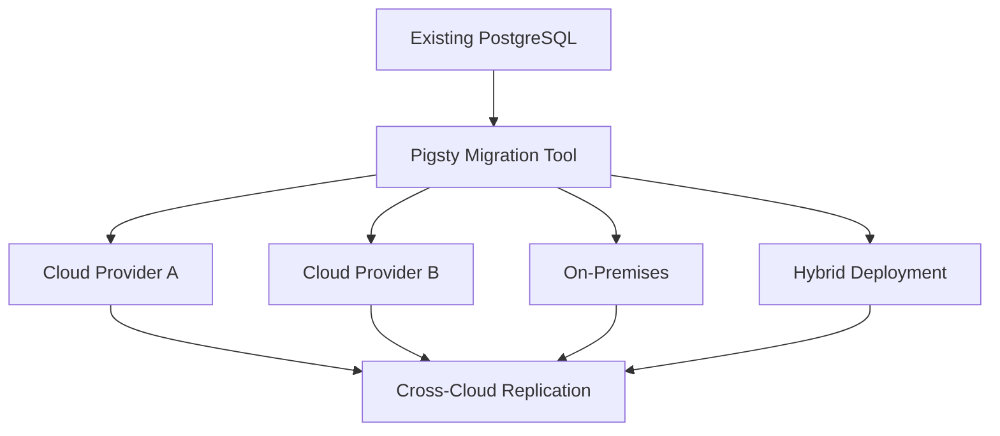

# Pigsty vs Alternatives

Pigsty positions itself as a **local-first, open-source PostgreSQL platform** that challenges traditional cloud database services and complex orchestration platforms. This comparison demonstrates Pigsty's advantages across key dimensions.

## Cloud RDS Comparison

### AWS RDS PostgreSQL vs Pigsty

| Feature                   | AWS RDS PostgreSQL         | Pigsty                             |
|---------------------------|----------------------------|------------------------------------|
| **Deployment**            | Managed cloud service      | Self-hosted on bare metal/VM/cloud |
| **Cost**                  | $200-1,300/core/month      | $20-40/core/month hardware cost    |
| **Licensing**             | Proprietary + usage fees   | AGPLv3 open source                 |
| **Extensions**            | Limited, AWS-approved only | 400+ extensions freely available   |
| **Monitoring Metrics**    | 99 basic metrics           | 3,000+ comprehensive metrics       |
| **Dashboards**            | CloudWatch basic views     | 50+ specialized dashboards         |
| **Superuser Access**      | Restricted                 | Full superuser privileges          |
| **Data Sovereignty**      | AWS controlled             | Complete local control             |
| **Offline Operation**     | Impossible                 | Full offline capability            |
| **Migration Flexibility** | Vendor lock-in             | Multi-cloud portability            |

### Cost Analysis

**Traditional Cloud RDS Pricing:**
- AWS RDS: $1,920-$2,640/vCPU/year
- Alibaba Cloud: $200-1,300/core/month
- Azure Database: Similar premium pricing

**Pigsty Total Cost of Ownership:**
- Hardware: $27/vCPU/year
- Software: Free (open source)
- **Savings: 50-95%** compared to cloud RDS

### Observability Advantage

**Pigsty Monitoring Capabilities:**
- **3,000+ metrics** vs cloud providers' 99-200 metrics
- **638 PostgreSQL-specific metrics** for deep database insights
- **50+ pre-built dashboards** covering all infrastructure layers
- **Real-time query analysis** and performance tuning
- **Custom dashboard creation** with low-code tools

**Cloud Provider Limitations:**
- Basic CloudWatch/Azure Monitor metrics
- Limited customization options
- Additional costs for enhanced monitoring
- No access to underlying system metrics

## Kubernetes Operators Comparison

### Traditional K8s Operators vs Pigsty

| Aspect                 | Kubernetes Operators             | Pigsty                      |
|------------------------|----------------------------------|-----------------------------|
| **Complexity**         | High learning curve              | Simple Ansible-based        |
| **Dependencies**       | Kubernetes cluster required      | Bare Linux sufficient       |
| **Resource Overhead**  | Container orchestration overhead | Native performance          |
| **Monitoring**         | Separate monitoring stack needed | Integrated observability    |
| **Storage**            | Complex PV/PVC management        | Direct storage access       |
| **Networking**         | K8s networking complexity        | Standard Linux networking   |
| **Debugging**          | Multi-layer troubleshooting      | Direct system access        |
| **Operational Burden** | Kubernetes + DB operations       | Database-focused operations |

### Why Choose Pigsty Over K8s Operators

**Simplicity Benefits:**
- **No container orchestration** complexity
- **Direct hardware access** for optimal performance
- **Familiar Linux tools** for debugging and maintenance
- **Reduced attack surface** without container layers

**Operational Advantages:**
- **Lower resource overhead** compared to containerized solutions
- **Easier troubleshooting** with direct system access
- **Simpler backup/restore** operations
- **Native OS integration** for security and monitoring

## PostgreSQL Distributions Comparison

### Commercial Distributions

| Feature               | EnterpriseDB        | Postgres Pro      | VMware Postgres     | Pigsty                  |
|-----------------------|---------------------|-------------------|---------------------|-------------------------|
| **Licensing**         | Commercial          | Commercial        | Commercial          | AGPLv3                  |
| **Cost**              | High license fees   | High license fees | High license fees   | Free                    |
| **Extensions**        | Limited selection   | Curated set       | VMware-specific     | 400+ available          |
| **Monitoring**        | Additional purchase | Basic included    | vCenter integration | 3,000+ metrics included |
| **High Availability** | Enterprise feature  | Available         | Available           | Built-in                |
| **Support**           | Paid support only   | Paid support      | VMware support      | Community + commercial  |

### Open Source Alternatives

| Solution                   | Focus Area           | Pigsty Advantage                         |
|----------------------------|----------------------|------------------------------------------|
| **Patroni**                | HA clustering only   | Complete platform with monitoring        |
| **PostgreSQL Helm Charts** | K8s deployment       | No K8s dependency, simpler ops           |
| **Postgres Operator**      | K8s orchestration    | Native performance, easier management    |
| **TimescaleDB Cloud**      | Time-series focus    | General-purpose with time-series support |
| **Supabase**               | Backend-as-a-Service | Full infrastructure control              |

--------

## Multi-Cloud Strategy

### Vendor Lock-in Avoidance

**Cloud Provider Lock-in Risks:**
- Proprietary APIs and tooling
- Data transfer costs for migration
- Feature dependency on specific platforms
- Pricing changes and service discontinuation

**Pigsty Multi-Cloud Benefits:**
- **Portable across any Linux environment**
- **Consistent operations** regardless of underlying infrastructure
- **Freedom to negotiate** with cloud providers
- **Hybrid deployment** capabilities

### Migration Flexibility

**Migration Capabilities:**
- **Logical replication** for live migration
- **Point-in-time recovery** across environments
- **Configuration portability** via Infrastructure as Code
- **Zero-downtime migration** procedures

--------

## Extension Ecosystem

### Extension Availability Comparison

| Category        | Cloud RDS              | Pigsty                            |
|-----------------|------------------------|-----------------------------------|
| **Analytics**   | Limited (no pg_duckdb) | Full OLAP stack                   |
| **Vector/AI**   | Basic pgvector         | pgvector, pgml, pg_embedding      |
| **Geospatial**  | PostGIS only           | PostGIS + advanced GIS extensions |
| **Time Series** | Basic TimescaleDB      | TimescaleDB + specialized tools   |
| **Graph**       | Not available          | Apache AGE + graph extensions     |
| **Search**      | Basic text search      | Advanced search + vector hybrid   |
| **Monitoring**  | None                   | pg_stat_monitor + custom metrics  |

### Enterprise Extensions

**Pigsty Includes:**
- **pg_duckdb**: Extreme analytics performance
- **PostgresML**: In-database machine learning
- **Citus**: Distributed PostgreSQL
- **PostGIS**: Advanced geospatial capabilities
- **pgvector**: Vector similarity search
- **TimescaleDB**: Time-series optimization

**Cloud Limitations:**
- Restricted extension catalog
- Version dependencies
- Installation restrictions
- Limited configuration options

--------

## Performance Characteristics

### Hardware Optimization

**Pigsty Performance Advantages:**
- **Direct hardware access** without virtualization overhead
- **Custom kernel tuning** for database workloads
- **NUMA awareness** and CPU affinity optimization
- **Storage optimization** for specific workload patterns

**Benchmark Results:**
- **2M rows/second** query throughput on optimized hardware
- **1M rows/second** write performance
- **75µs 4K random read latency** with NVMe storage
- **3M IOPS** sustained performance

**Efficiency Gains:**
- **Eliminated virtualization overhead**
- **Direct I/O access** patterns
- **Custom memory management**
- **Optimized network stack**

--------

## Security and Compliance

### Security Model Comparison

| Security Aspect              | Cloud RDS                 | Pigsty                      |
|------------------------------|---------------------------|-----------------------------|
| **Data Location**            | Cloud provider controlled | Fully controlled            |
| **Encryption**               | Provider-managed keys     | Self-managed PKI            |
| **Access Control**           | Platform-dependent        | Full administrative control |
| **Audit Logging**            | Limited visibility        | Complete audit trail        |
| **Compliance**               | Provider certifications   | Direct compliance control   |
| **Vulnerability Management** | Provider responsibility   | Direct security management  |

### Data Sovereignty

**Pigsty Sovereignty Benefits:**
- **Complete data ownership** and control
- **Local compliance** with data protection regulations
- **No third-party data access** concerns
- **Custom security policies** implementation
- **Air-gapped deployment** capabilities

--------

## Decision Framework

### When to Choose Pigsty

**Ideal Use Cases:**
- **Cost-sensitive** deployments requiring significant savings
- **High-performance** applications needing optimal resource utilization
- **Compliance-critical** environments requiring data sovereignty
- **Complex analytics** workloads needing advanced extensions
- **Multi-cloud strategies** avoiding vendor lock-in
- **Existing infrastructure** with available hardware resources

### When to Consider Alternatives

**Cloud RDS Advantages:**
- **Minimal operational overhead** for small teams
- **Quick proof-of-concept** development
- **Geographic distribution** without infrastructure management
- **Compliance certifications** already established

**Migration Path:**
- Start with cloud RDS for rapid development
- Migrate to Pigsty for production cost optimization
- Maintain hybrid deployments for specific use cases

---

Pigsty delivers enterprise-grade PostgreSQL capabilities with significant cost savings, superior observability, and complete operational control, making it an compelling alternative to cloud database services and complex orchestration platforms.
